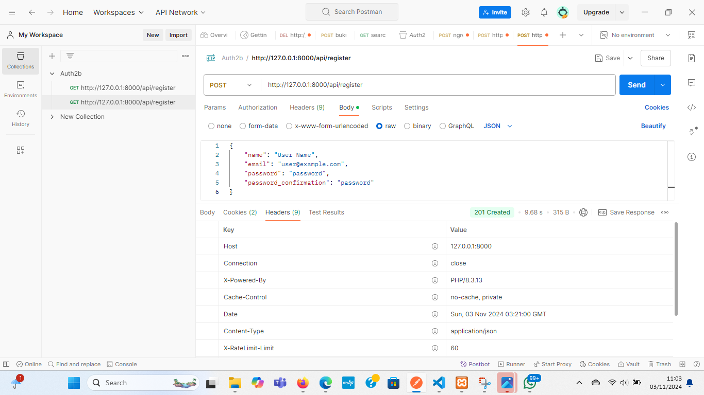
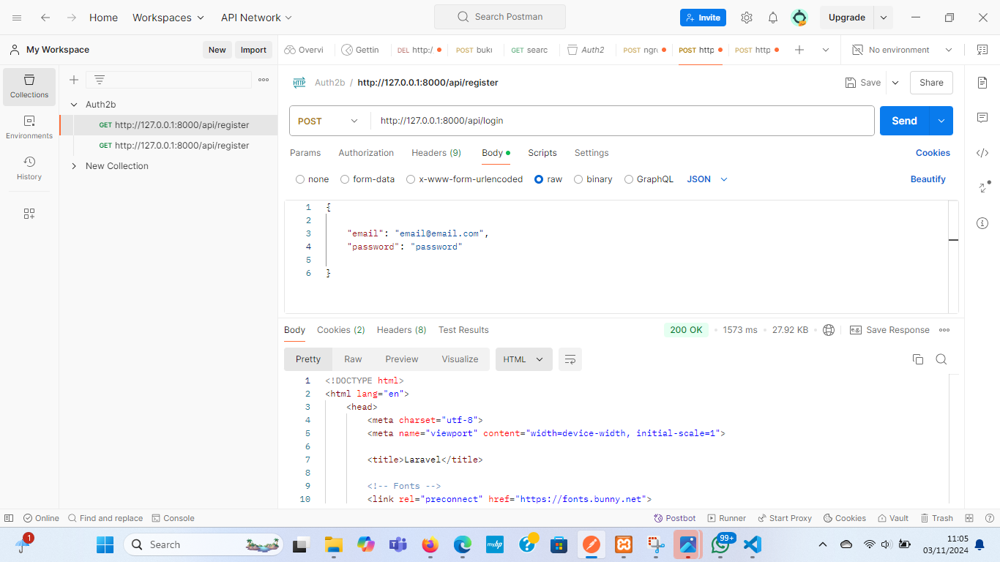
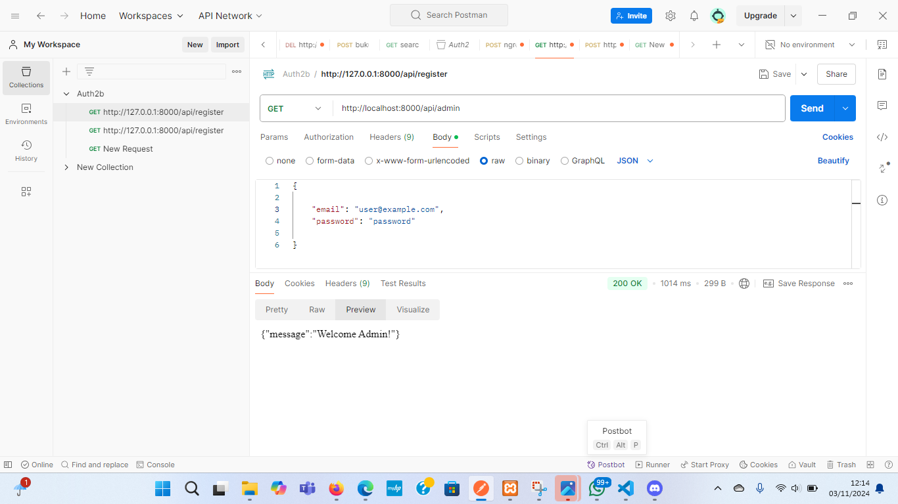
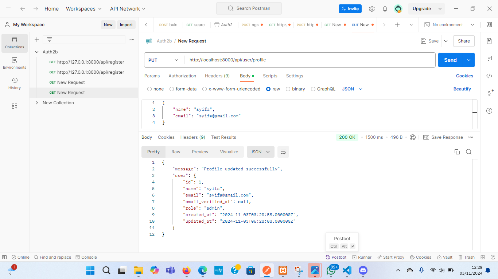
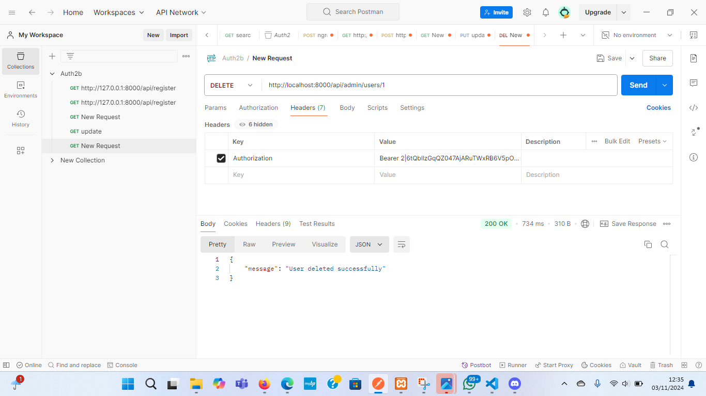
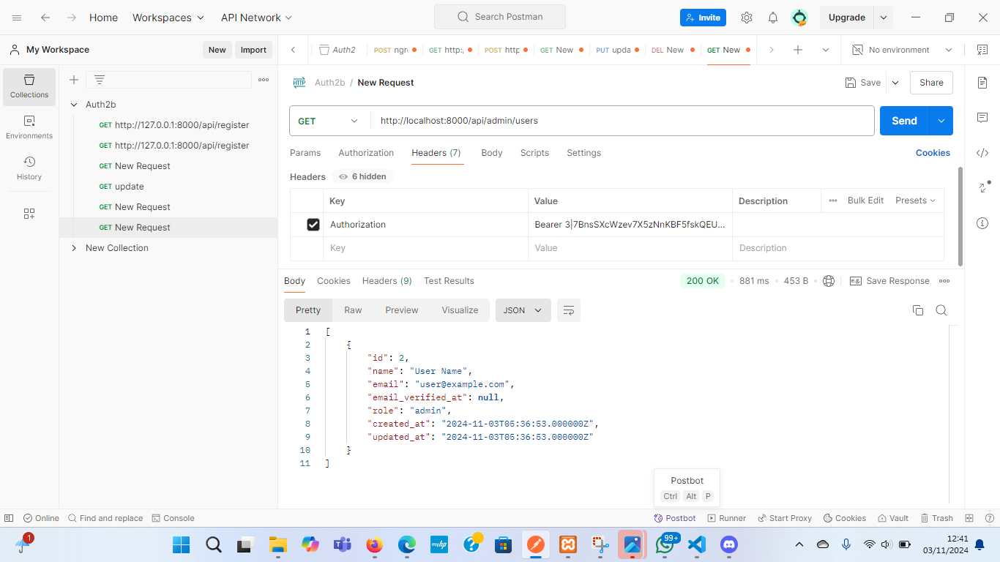

## Laporan Praktikum: Membangun API dengan Autentikasi dan Otorisasi menggunakan Laravel 10

> Pertanyaan Evaluasi
1. Apa yang dimaksud dengan Laravel Sanctum?
Jawab: 
Laravel Sanctum adalah paket yang disediakan oleh Laravel untuk mengelola autentikasi berbasis token sederhana untuk aplikasi SPA (Single Page Application), aplikasi mobile, dan API. Sanctum memungkinkan aplikasi untuk membuat token yang bisa digunakan untuk autentikasi pengguna, sehingga pengguna bisa mengakses endpoint atau sumber daya tertentu dalam aplikasi.

2. Bagaimana cara mengelola token autentikasi di Laravel?
Jawab:
-Instal laravel sanctum
-Konfigurasi model user
-Buat endpoint untuk login dan pembuatan token
-Menggunakan token untuk autentikasi di api
-Membuat middlewere untuk melindungi endpoint
-Logout dan menghapus token

3. Sebutkan langkah-langkah untuk menambahkan otorisasi berbasis peran dalam API!
Jawab:
-Tambahkan kolom role pada tabel pengguna
-Buat middleware untuk memeriksa peran
-Tambahkan logika middlewere
-Daftarkan middlewere di kernel
-Terapkan middlewere di route API
-Menambahkan cek otoritasi di controller (opsional)
-Pengujian API

> Tugas Praktikum
1. Register User

2. Login User

3. Akses Rute Admin

4. Tambahkan fitur untuk memperbarui profil pengguna

5. Implementasikan sistem untuk menghapus pengguna dengan otorisasi admin

6. Buat API untuk mengambil daftar semua pengguna (hanya bisa diakses oleh admin

> Kesimpulan
Modul ini memberikan pemahaman mendalam tentang cara membangun API dengan autentikasi 
dan otorisasi menggunakan Laravel 10. Mahasiswa dapat menerapkan pengetahuan ini untuk 
mengembangkan aplikasi web yang aman dan terkelola